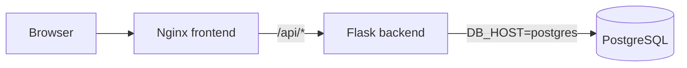

# Docker Lab 2

Практическая работа по Docker, Docker Compose и Git.

## Описание проекта

Проект представляет собой простое fullstack-приложение To-Do List для управления списком задач.

Приложение состоит из трёх сервисов:

* `frontend` — Nginx, отдаёт HTML-страницу и проксирует API-запросы;
* `backend` — Python Flask API с CRUD-операциями для задач;
* `postgres` — PostgreSQL для хранения задач.

Основная цель работы — показать умение контейнеризировать приложение, связать несколько сервисов через Docker Compose, настроить хранение данных в volume и организовать работу через Git-ветки и коммиты.

## Архитектура

```text
Browser
  |
  | http://localhost
  v
frontend: Nginx
  |
  | /api/*
  v
backend: Flask + Gunicorn
  |
  | DB_HOST=postgres
  v
postgres: PostgreSQL
```

## Mermaid-схема



## Структура проекта

```text
docker-lab2/
├── docker-compose.yml
├── .env.example
├── .env
├── .gitignore
├── README.md
├── backend/
│   ├── Dockerfile
│   ├── app.py
│   └── requirements.txt
└── frontend/
    ├── Dockerfile
    ├── nginx.conf
    └── html/
        └── index.html
```

Файл `.env` не хранится в Git, потому что содержит локальные переменные окружения и пароль к базе данных.

## Переменные окружения

Пример переменных находится в файле `.env.example`:

```env
POSTGRES_DB=taskdb
POSTGRES_USER=appuser
POSTGRES_PASSWORD=changeme
```

Описание:

* `POSTGRES_DB` — имя базы данных PostgreSQL;
* `POSTGRES_USER` — пользователь PostgreSQL;
* `POSTGRES_PASSWORD` — пароль пользователя PostgreSQL;
* `DB_HOST` — адрес базы данных для backend. В `docker-compose.yml` установлен как `postgres`, потому что backend обращается к базе по имени сервиса внутри Docker-сети.

## Запуск проекта

Клонировать репозиторий:

```powershell
git clone https://github.com/Raskol-dm/docker-lab2.git
cd docker-lab2
```

Создать `.env` на основе примера:

```powershell
Copy-Item .env.example .env
```

Запустить приложение:

```powershell
docker compose up -d --build
```

После запуска приложение доступно по адресу:

```text
http://localhost
```

## Проверка API

Healthcheck:

```powershell
curl.exe http://localhost/api/health
```

Ожидаемый ответ:

```json
{"status":"ok"}
```

Получить список задач:

```powershell
curl.exe http://localhost/api/tasks
```

Создать задачу через PowerShell:

```powershell
$body = @{ title = "Task 1: check persistence" } | ConvertTo-Json
Invoke-RestMethod -Uri "http://localhost/api/tasks" -Method Post -ContentType "application/json" -Body $body
```

## Полезные команды Docker Compose

Запуск проекта:

```powershell
docker compose up -d --build
```

Остановка проекта без удаления данных:

```powershell
docker compose down
```

Остановка проекта с удалением volume:

```powershell
docker compose down -v
```

Посмотреть состояние контейнеров:

```powershell
docker compose ps
```

Посмотреть логи backend:

```powershell
docker compose logs -f backend
```

Посмотреть логи frontend:

```powershell
docker compose logs -f frontend
```

Посмотреть логи PostgreSQL:

```powershell
docker compose logs -f postgres
```

Войти внутрь backend-контейнера:

```powershell
docker compose exec backend sh
```

Войти в PostgreSQL:

```powershell
docker compose exec postgres psql -U appuser -d taskdb
```

Посмотреть таблицы в PostgreSQL:

```sql
\dt
```

Посмотреть задачи:

```sql
SELECT * FROM tasks;
```

Выйти из PostgreSQL:

```sql
\q
```

## Проверка Docker-сети

Список сетей:

```powershell
docker network ls
```

Инспект сети проекта:

```powershell
docker network inspect docker-lab2_default
```

В проекте используется user-defined bridge network, которую Docker Compose создаёт автоматически. Благодаря этому контейнеры могут обращаться друг к другу по именам сервисов: `frontend`, `backend`, `postgres`.

Например, в конфигурации Nginx API проксируется на:

```nginx
proxy_pass http://backend:5000;
```

А backend подключается к PostgreSQL по адресу:

```text
postgres
```

## Проверка Docker volumes

Список volumes:

```powershell
docker volume ls
```

В проекте используется именованный volume:

```text
postgres_data
```

Он подключён к PostgreSQL:

```yaml
volumes:
  - postgres_data:/var/lib/postgresql/data
```

## Проверка персистентности данных

Для проверки были созданы задачи через API.

После команды:

```powershell
docker compose down
docker compose up -d
```

задачи сохранились.

Причина: команда `docker compose down` удаляет контейнеры и сеть, но не удаляет именованные volumes. Данные PostgreSQL остаются в volume `postgres_data`.

После команды:

```powershell
docker compose down -v
docker compose up -d
```

задачи исчезли.

Причина: флаг `-v` удаляет volumes. В нашем случае удаляется volume `postgres_data`, в котором лежали файлы PostgreSQL. После следующего запуска база создаётся заново и становится пустой.

## Git workflow

В работе использовались отдельные ветки:

* `feature/backend` — Flask API и Dockerfile backend;
* `feature/frontend` — HTML-интерфейс, Nginx config и Dockerfile frontend;
* `feature/compose` — Docker Compose, проверка персистентности и документация.

Основные коммиты:

```text
init: project structure, .gitignore, README
feat(backend): Flask API with CRUD for tasks
feat(frontend): Nginx with static HTML and API proxy
feat(compose): full stack with postgres, backend, frontend
docs: persistence test results, debug notes
docs: final README with architecture and instructions
```

## Проверка из свежего клона

Для проверки, что проект запускается у другого разработчика:

```powershell
cd C:\IY21M\DevOps\Lab2_DockerComp
git clone https://github.com/Raskol-dm/docker-lab2.git test-clone
cd test-clone
Copy-Item .env.example .env
docker compose up -d --build
```

Проверить:

```powershell
curl.exe http://localhost/api/health
```

Открыть в браузере:

```text
http://localhost
```
